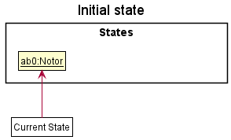
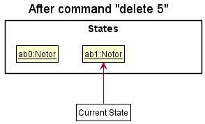
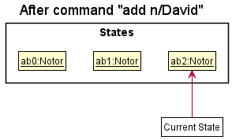
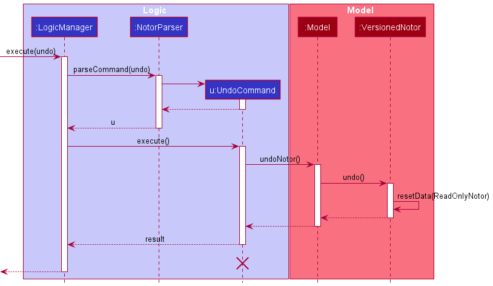
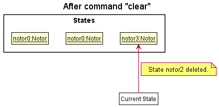

* Table of Contents {:toc}

--------------------------------------------------------------------------------------------------------------------

## **Acknowledgements**

This project is a further iteration of the [_AddressBook-Level 3 (
AB-3)_](https://nus-cs2103-ay2122s1.github.io/tp/DeveloperGuide.html) project. All features we have are in addition to
those already present in AB-3. Removed features are listed as well.

--------------------------------------------------------------------------------------------------------------------

## **Setting up, getting started**

Refer to the guide [_Setting up and getting started_](SettingUp.md).

--------------------------------------------------------------------------------------------------------------------

## Glossary

* **Autocomplete**: A functionality to complete a `Tag` or a `Command` without users typing the complete strings
* **Command structure**: The order in which parameters and command words must be written in order for the command to be
  correctly parsed
* **Dummy data**: Sample data used in testing or example data present on first launch of application
* **Group**: A container containing `Person` objects with shared traits that is created by the user
* **Key power features**: Essential features that will be used often when running the software application
* **Mainstream OS**: Windows, Linux, Unix, MacOS
* **Metadata**: Personal data about a `Person` object
* **Note**: A general description of each `Person` to record their activities, with last edit timestamp attached
* **Pin**: Fixing a `Person` to the top of the current list of `Person` objects or a `Group`
* **Subgroup**: A child of a `Group` used to store multiple persons based on a more specific category than `Group`. A **
  Subgroup** can be created by specifying the parent group of the **Subgroup**. A person in a **Subgroup** is
  automatically in the parent `Group` as well
* **Tag**: A string descriptor attached to `Group` objects or `Person` objects
* **Ungrouped**: Used to describe a `Person` object with no grouping

--------------------------------------------------------------------------------------------------------------------

## **Design**

### Architecture

The **Architecture** of our iteration is built upon AB-3. Please refer to the AB-3 **Architecture**
section for the general Architectural design of the app. Only changes will be listed here.

### Model Changes

*(placeholder API for now, will update to our own link later when implemented.)*

**
API** : [`Model.java`](https://github.com/se-edu/addressbook-level3/tree/master/src/main/java/seedu/address/model/Model.java)

* `Person` does not contain the `Address` field anymore.
* `Person` contains a new `Note` field.
* This UML diagram is the current class structure implemented.

Here is the better class structure to be implemented:

* `Trie` allows tags to be autocompleted as commands are entered.
* Storing `String` objects in a `Trie` in AddressBook allows all tags to only get created once instead of once per
  object.
* Storing tags as `String` objects in a trie is simpler than a dedicated `Tag` class.

### Storage component

*(placeholder API for now, will update to our own link later when implemented.)*

**
API** : [`Storage.java`](https://github.com/se-edu/addressbook-level3/tree/master/src/main/java/seedu/address/storage/Storage.java)

The `Storage` component,

* now includes a new `Archive` Storage component
* `Archive` allows users to temporarily remove `Person`s from their Address Book

### Common classes

**
API** : [`Trie.java`](https://github.com/AY2122S1-CS2103T-W08-1/tp/blob/master/src/main/java/seedu/address/commons/core/trie/Trie.java)

* Allows grouping and autocompletion of `Tag` and `Command` objects.
* Supports addition and deletion of items.
* Supports finding of first item.
* Supports finding of first item that contains specified keyword.

--------------------------------------------------------------------------------------------------------------------

## **Implementation**

This section describes some noteworthy details on how certain features are implemented.

### \[Proposed\] Undo/redo feature

#### Proposed Implementation

The proposed undo/redo mechanism is facilitated by `VersionedAddressBook`. It extends `AddressBook` with an undo/redo
history, stored internally as an `addressBookStateList` and `currentStatePointer`. Additionally, it implements the
following operations:

* `VersionedAddressBook#commit()` — Saves the current address book state in its history.
* `VersionedAddressBook#undo()` — Restores the previous address book state from its history.
* `VersionedAddressBook#redo()` — Restores a previously undone address book state from its history.

These operations are exposed in the `Model` interface as `Model#commitAddressBook()`, `Model#undoAddressBook()`
and `Model#redoAddressBook()` respectively.

Given below is an example usage scenario and how the undo/redo mechanism behaves at each step.

Step 1. The user launches the application for the first time. The `VersionedAddressBook` will be initialized with the
initial address book state, and the `currentStatePointer` pointing to that single address book state.

Step 2. The user executes `delete 5` command to delete the 5th person in the address book. The `delete` command
calls `Model#commitAddressBook()`, causing the modified state of the address book after the `delete 5` command executes
to be saved in the `addressBookStateList`, and the `currentStatePointer` is shifted to the newly inserted address book
state.

Step 3. The user executes `add n/David …​` to add a new person. The `add` command also calls `Model#commitAddressBook()`
, causing another modified address book state to be saved into the `addressBookStateList`.

:information_source: **Note:** If a command fails its execution, it will not call `Model#commitAddressBook()`, so the address book state will not be saved into the `addressBookStateList`.

Step 4. The user now decides that adding the person was a mistake, and decides to undo that action by executing
the `undo` command. The `undo` command will call `Model#undoAddressBook()`, which will shift the `currentStatePointer`
once to the left, pointing it to the previous address book state, and restores the address book to that state.

:information_source: **Note:** If the `currentStatePointer` is at index 0, pointing to the initial AddressBook state, then there are no previous AddressBook states to restore. The `undo` command uses `Model#canUndoAddressBook()` to check if this is the case. If so, it will return an error to the user rather
than attempting to perform the undo.

The following sequence diagram shows how the undo operation works:

:information_source: **Note:** The lifeline for `UndoCommand` should end at the destroy marker (X) but due to a limitation of PlantUML, the lifeline reaches the end of diagram.

The `redo` command does the opposite — it calls `Model#redoAddressBook()`, which shifts the `currentStatePointer` once
to the right, pointing to the previously undone state, and restores the address book to that state.

:information_source: **Note:** If the `currentStatePointer` is at index `addressBookStateList.size() - 1`, pointing to the latest address book state, then there are no undone AddressBook states to restore. The `redo` command uses `Model#canRedoAddressBook()` to check if this is the case. If so, it will return an error to the user rather than attempting to perform the redo.

Step 5. The user then decides to execute the command `list`. Commands that do not modify the address book, such
as `list`, will usually not call `Model#commitAddressBook()`, `Model#undoAddressBook()` or `Model#redoAddressBook()`.
Thus, the `addressBookStateList` remains unchanged.

Step 6. The user executes `clear`, which calls `Model#commitAddressBook()`. Since the `currentStatePointer` is not
pointing at the end of the `addressBookStateList`, all address book states after the `currentStatePointer` will be
purged. Reason: It no longer makes sense to redo the `add n/David …​` command. This is the behavior that most modern
desktop applications follow.

The following activity diagram summarizes what happens when a user executes a new command:

#### Design considerations:

**Aspect: How undo & redo executes:**

* **Alternative 1 (current choice):** Saves the entire address book.
    * Pros: Easy to implement.
    * Cons: May have performance issues in terms of memory usage.

* **Alternative 2:** Individual command knows how to undo/redo by itself.
    * Pros: Will use less memory (e.g. for `delete`, just save the person being deleted).
    * Cons: We must ensure that the implementation of each individual command are correct.

_{more aspects and alternatives to be added}_

### \[Proposed\] Data archiving

_{Explain here how the data archiving feature will be implemented}_

--------------------------------------------------------------------------------------------------------------------

## **Documentation, logging, testing, configuration, dev-ops**

* [Documentation guide](Documentation.md)
* [Testing guide](Testing.md)
* [Logging guide](Logging.md)
* [Configuration guide](Configuration.md)
* [DevOps guide](DevOps.md)

--------------------------------------------------------------------------------------------------------------------

## **Appendix: Requirements**

### Product scope

**Target user profile**: mentor professors
* has a need to manage a significant number of contacts
* prefer desktop apps over other types
* can type fast
* prefers typing to mouse interactions
* is reasonably comfortable using CLI apps
* has groups of contacts that have different needs

**Value proposition**: manage contacts faster than a typical mouse/GUI driven app

### User stories

Priorities:

* High - must have

* Medium - nice to have

* Low - unlikely to have

* Default - already implemented)

|As a …                                                                                      |I want to …                                                                                                   |So that I can …                                            |Priority    |Status     |When?         |
|--------------------------------------------------------------------------------------------|--------------------------------------------------------------------------------------------------------------|-----------------------------------------------------------|------------|-----------|--------------|
|on the go user                                                                              |add notes without wifi or internet access                                                                     |use the app anywhere                                       |Default     |           |Iteration 1.2 |
|new user                                                                                    |have dummy data                                                                                               |see what my entries look like                              |Default     |           |Iteration 1.2 |
|new user                                                                                    |remove all dummy entries easily                                                                               |start doing work quickly                                   |Medium      |           |Iteration 1.2 |
|general user, new user                                                                      |see a simple UI which shows essential features immediately and hides away advanced features till you need them|slowly learn the features                                  |High        |           |Iteration 1.2 |
|general user, mentor professor, module professor                                            |take notes with timestamps                                                                                    |see my notes chronologically                               |High        |           |Iteration 1.2 |
|general user, mentor professor, module professor                                            |edit the groups or tags of a student                                                                          |                                                           |High        |           |Iteration 1.2 |
|mentor professor                                                                            |group the students based on the mentoring subjects                                                            |tag or comment on each group separately                    |High        |           |Iteration 1.2 |
|general user, mentor professor, module professor                                            |have easy-to-remember commands for inputting information                                                      |                                                           |High        |           |Iteration 1.2 |
|general user                                                                                |delete groups/subgroups                                                                                       |                                                           |High        |Not started|Iteration 1.2 |
|experienced user, general user                                                              |add tags cumulatively                                                                                         |not retype my old tags                                     |High        |Not started|Iteration 1.2 |
|new user                                                                                    |see clear error messages that explains how to enter the correct command                                       |learn the right syntax from my errors                      |High        |Not started|Iteration 1.2b|
|experienced user, general user, mentor professor, module professor                          |edit previous notes I have taken                                                                              |                                                           |High        |           |Iteration 1.2b|
|mentor professor, module professor, new user                                                |have an easily accessible help page                                                                           |                                                           |High        |           |Iteration 1.2b|
|experienced user, general user, mentor professor, module professor, new user, on the go user|search by tag/category                                                                                        |find students based on tag/category                        |High        |Not started|Iteration 1.2b|
|general user, mentor professor, module professor                                            |have notes attached to categories                                                                             |save notes relevant to a whole group                       |Medium      |           |Iteration 1.2b|
|general user                                                                                |create general notes                                                                                          |take down any thoughts I have on the fly                   |Medium      |Not started|Iteration 1.2b|
|new user                                                                                    |see a confirmation message if I choose to delete something                                                    |avoid accidental deletions                                 |Medium      |           |Iteration 1.2b|
|experienced user, mentor professor, module professor                                        |specify the kinds of data attached to contacts which is viewable from the front page                          |only see information that I need                           |Nice To Have|           |Iteration 1.3 |
|general user                                                                                |display all of the user information in an easy to reference format                                            |read large amounts of information at once easily           |Medium      |           |Iteration 1.3 |
|mentor professor, module professor                                                          |initialise the contacts for many students at once                                                             |add similar students by batch                              |Medium      |           |Iteration 1.3 |
|mentor professor                                                                            |see the last time I contacted a student                                                                       |know if I need to check up on them                         |Medium      |           |Iteration 1.3 |
|new user                                                                                    |get prompted for the arguments.                                                                               |learn the command structure                                |Medium      |           |Iteration 1.3 |
|experienced user                                                                            |pin users I need to access regularly                                                                          |see commonly accessed users easily                         |Low         |           |Iteration 1.3b|
|experienced user                                                                            |see personal metadata such as number of high-priority students & number of contacts                           |determine my own usage                                     |Low         |           |Iteration 1.3b|
|new user                                                                                    |see a short tutorial                                                                                          |get familiar with key features                             |Low         |Not started|Iteration 1.3b|
|general user                                                                                |see a list of recently looked up people                                                                       |quickly add on thoughts on the people I've just seen       |Medium      |           |Iteration 1.3b|
|mentor professor, module professor                                                          |hide groups                                                                                                   |ignore groups no longer relevant to me                     |Low         |           |Iteration 1.3b|
|general user, mentor professor, module professor, on the go user                            |export the data to PDF & CSV / Excel                                                                          |reference the information in another format                |Low         |           |Iteration 1.3b|
|experienced user                                                                            |sort by complete inclusion of terms rather than matching any term                                             |narrow down my search results easily                       |Low         |Not started|Iteration 1.3b|
|general user                                                                                |create general reminders                                                                                      |remind myself of tasks I need to do for my mentees/students|Low         |Not started|Iteration 1.3b|
|experienced user, module professor                                                          |set my own command aliases                                                                                    |use my own commands when I am used to them                 |Low         |           |Delay         |
|experienced user, mentor professor, module professor                                        |use shorter commands                                                                                          |save time                                                  |Medium      |           |Delay         |

### Use cases

(For all use cases below, the **System** is the `AddressBook` and the **Actor** is the `user`, unless specified
otherwise)

**Use case: Add a note**

**MSS**

1. User requests to add a note to the person
2. AddressBook shows a list of persons
3. User requests to add a note to a specific person in the list
4. AddressBook opens up a pop up dialogue for the user to type the note for the person
5. User requests to save the note to the person
6. AddressBook stores the book to the person
7. AddressBook saves the note to storage

   Use case ends.

**Extensions**

* 2a. The list is empty. Use case ends.

* 3a. The given index is invalid.
    * 3a1. AddressBook shows an error message. Use case resumes at step 2.

**Use case: User types a command**

**MSS**

1. User starts typing a command in AddressBook
2. AddressBook shows possible commands starting with what user has typed
3. User presses tab to select the right command
4. User presses enter to execute the selected command
5. AddressBook <u>runs command (UC1)</u>

   Use case ends.

**Extensions**

* 2a. The typed string is not in any command.
    * 2a1. AddressBook displays no commands. Use case resumes at step 1.

### Non-Functional Requirements

1. Should work on any _mainstream OS_ as long as it has Java `11` or above installed.
2. Should be able to hold up to 1000 persons without a noticeable sluggishness in performance for typical usage.
3. A user with above average typing speed for regular English text (i.e., not code, not system admin commands) should be
   able to accomplish most of the tasks faster using commands than using the mouse.
4. Installing a new update shall not in any way, modify or erase existing data and value from the previous version, and
   the new update should be compatible with the data produced earlier within the system.
5. Should be able to store notes in English language, and provisions shall be made to support all languages.
6. The system should be able to handle notes with at most 1000 lines without any noticeable decrease in performance, so
   that users can keep extensive notes on their mentees.
7. The user should not lose any data if the system exits prematurely.
8. The system should be able to reply to the prompt or command from the user within 3 seconds.
9. The system should be intuitive to use for a mentor professor.
10. Should ensure personal data privacy and security of data access.
11. Software testing will require the use of automated testing. The test will be deleted after successful implementation
    of the software system.

--------------------------------------------------------------------------------------------------------------------

## **Appendix: Instructions for manual testing**

Given below are instructions to test the app manually.

:information_source: **Note:** These instructions only provide a starting point for testers to work on;
testers are expected to do more *exploratory* testing.

### Launch and shutdown

1. Initial launch

    1. Download the jar file and copy into an empty folder

    1. Double-click the jar file Expected: Shows the GUI with a set of sample contacts. The window size may not be
       optimum.

1. Saving window preferences

    1. Resize the window to an optimum size. Move the window to a different location. Close the window.

    1. Re-launch the app by double-clicking the jar file. 
       Expected: The most recent window size and location is retained.

1. _{ more test cases …​ }_

### Deleting a person

1. Deleting a person while all persons are being shown

    1. Prerequisites: List all persons using the `list` command. Multiple persons in the list.

    1. Test case: `delete 1` 
       Expected: First contact is deleted from the list. Details of the deleted contact shown in the status message.
       Timestamp in the status bar is updated.

    1. Test case: `delete 0` 
       Expected: No person is deleted. Error details shown in the status message. Status bar remains the same.

    1. Other incorrect delete commands to try: `delete`, `delete x`, `...` (where x is larger than the list size) 
       Expected: Similar to previous.

1. _{ more test cases …​ }_

### Saving data

1. Dealing with missing/corrupted data files

    1. _{explain how to simulate a missing/corrupted file, and the expected behavior}_

1. _{ more test cases …​ }_
