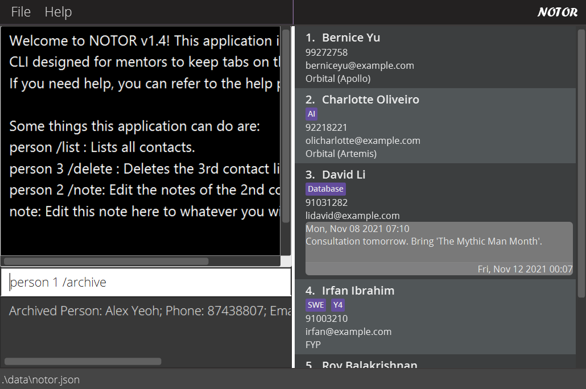
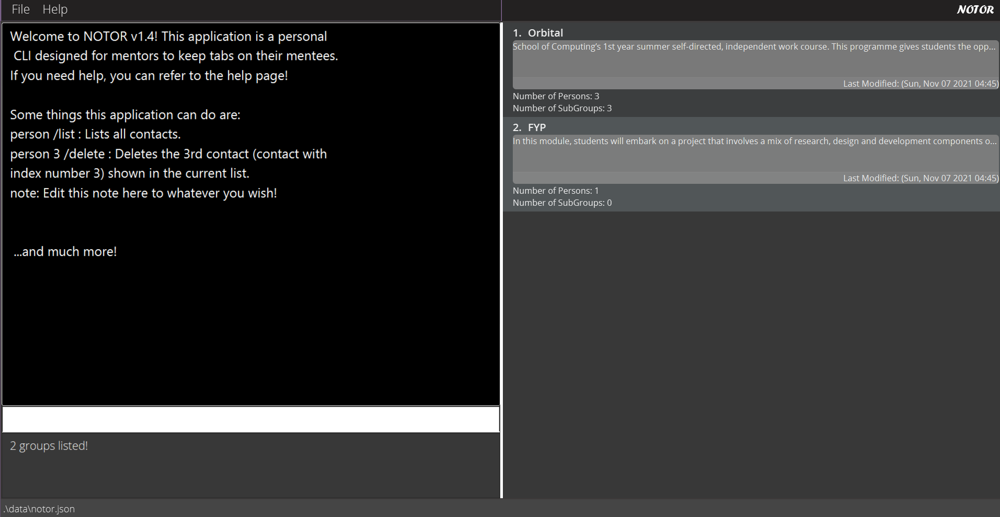
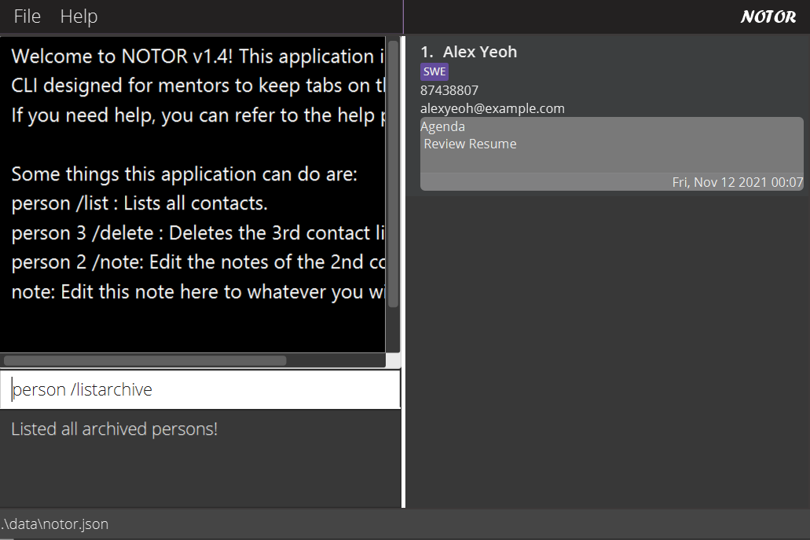
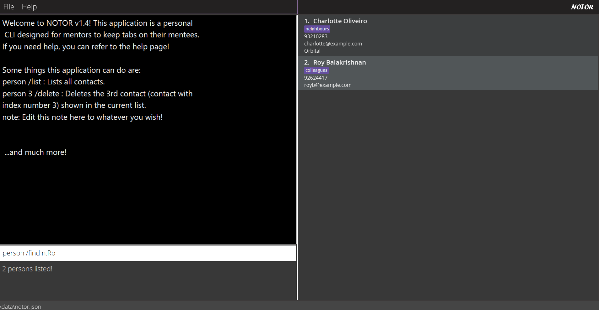

## Overview  
Notor is a desktop application for mentors to keep tabs on their mentees, **optimized for use via a Command Line Interface** (CLI) while still having the benefits of a Graphical User Interface (GUI). If you can type faster than the average typing speed, Notor allows you to take notes quickly and efficiently, while keeping them in an easy to reference format, which is vital if you are taking notes during meetings with mentees.

* Table of Contents
{:toc}

### Using this User Guide

If you're new to Notor, hop over to [Quick Start](#quick-start) to install and begin using it. If you already know what you want, use the Table of Contents to find the feature you are looking for, or the [Command Summary](#command-summary) to view all commands available. If you've used Notor for a while and are looking to get the best out of Notor, 'level-up' by reading our [Tips on Using Notor](#tips-on-using-notor).

Some terminology that might help:
1. **List pane** : The panel located on the right, which is used to display the  list of persons or groups
2. **View pane** : The panel on the left, used to view notes, such as general notes
3. **Note Window**: The pop up window you may use to edit and add notes
4. **Command Box**: The box on the left pane, underneath the view pane, where you may type commands.

This block is used to highlight information you should pay attention to

:bulb: <strong>Tip:</strong>
Used to highlight tips.

:exclamation: <strong>Caution:</strong>
Used to highlight dangers.

--------------------------------------------------------------------------------------------------------------------

## Quick Start
### 1. Setup
Ensure you have Java `11` or above installed in your computer. You can install Java `11` from [here](https://www.oracle.com/in/java/technologies/javase/jdk11-archive-downloads.html).
### 2. Installing the project
Download the latest `notor.jar` [here](https://github.com/AY2122S1-CS2103T-W08-1/tp/releases), and copy the file to the folder you want to use as the _home folder_ for your Notor.
### 3. Running the application
Double-click the file to start the application. If you have set up Java `11` correctly, the application should open, and the GUI similar to below should appear in a few seconds.
Note how the app contains some sample data.  

### 4. Try Running Examples!
Type the command in the command box and press Enter to execute it. e.g. Typing **help** and pressing Enter will
open the help window.  
Some example commands you can try sequentially to get familiarise with Notor:

* **`person /list`** : Lists all contacts.
* **`person 3 /delete`** : Deletes the 3rd contact (contact with index number `3`) shown in the current list.
* **`person User /create`** : Creates a person named `User`.
* **`group Orbital /create`** : Creates a group named `Orbital`.
* **`person 3 /add g:Orbital`** : Adds the person with index `3` to the group `Orbital`.
* **`group /list`** : Lists all groups.
* **`group 1 /note`** : Edits the group note for the group with index number `1`.
* **`group 1 /create n:Artemis`** : Creates a subgroup `Artemis` inside the group with index number `1`.
* **`clear`** : Deletes all contacts.
* **`exit`** : Exits the application.  

Refer to the [Features](#features) below for details of each command.

--------------------------------------------------------------------------------------------------------------------

## Command Breakdown
Here is a detailed breakdown of all the commands Notor has available. All the commands have a shortened command format, referred to interchangeably as 'advanced format' and 'short format'.

**Notes about the command format:** 
* Words in `UPPER_CASE` are the parameters to be supplied by the user. 
  e.g. in `person /create n:NAME`, `NAME` is a parameter which can be used as `/create n:John Doe`.
* Round brackets `()` refer to COMPULSORY arguments. 
  e.g. `g:(GROUP_NAME)` means that the group name must be entered a that position.
* Items in square brackets are optional. 
  e.g. `n:NAME [g:GROUP_NAME]` can be used as `n:Elton g:Orbital` or as `n:Elton`.
* Items with `…`​ after them can be used multiple times including zero times, with a comma separating terms. 
  e.g. `[t/TAG…​]` can be used as ` ` (i.e. 0 times), `t:tag1, tag2, tag3` etc.
* Parameters can be in any order. 
  e.g. if the command specifies `g:GROUP_NAME sg:SUBGROUP_NAME`, `sg:SUBGROUP_NAME g:GROUP_NAME` is also acceptable.
* If a parameter is expected only once in the command, but you specified it multiple times, only the last occurrence of the parameter will be taken. 
  e.g. if you specify `p:12341234 p:56785678`, only `p:56785678` will be taken.
* Extraneous parameters for commands that do not take in parameters (such as `help`, `exit` and `clear`) will be
  ignored. 
  e.g. if the command specifies `help 123`, it will be interpreted as `help`.

### General Commands

#### _Viewing help_

Shows a message explaining how to access the help page.

:bulb: <strong>Tip:</strong>
If you type in a command with no arguments and the command requires arguments, this command will display a prompt for the arguments which should be given.

Format: `help`

#### _Clearing all entries_

Clears all entries from Notor. Be warned; data will be deleted and **will not be saved**. The intended use of this
command is to clear the dummy starting data, but you can also use it to reset your Notor from within the program.

Format: `clear`
* Take care not to confuse this command with the more specific`/clearnote` command.

#### _Exiting the program_

Exits the program and saves your data.

Format: `exit`

#### _Exporting data_

Exports all the data of Notor into a CSV file. The exported CSV will be located in the same directory as Notor.

Format: `export`

### Working with people
The base functionality of Notor is to allow you to maintain notes on people who you mentor. These are the commands you can use with the `person` prefix to manage your contacts

:exclamation: <strong>Caution:</strong>
This command only works when persons are listed in Notor.

  .

#### _Creating a person_

Creates a person.

Format: `person (NAME) /create [p:PHONE] [e:EMAIL] [t:TAG1,TAG2,...] [g:GROUP_INDEX]` 
Advanced user Format: `p (NAME) /c [p:PHONE] [e:EMAIL] [t:TAG1,TAG2,...] [g:GROUP_INDEX]`

* Creates a person with the `NAME`.
* Optional arguments:
  * `PHONE`: Phone number of the person.
  * `EMAIL`: Email of the person.
  * `TAG1,TAG2..`: Tag(s) that describe the person.
  * `GROUP_INDEX`: Index of the group in Notor to add the person to.

Examples:

* `person John Lim /create p:91119111 e:notor@notor.com t:Loves Dancing g:1`
* `p Michael Joe /c p:92229222 e:notor@notor.com t:Loves Singing g:2`
  

#### _Adding a person to a group_

Adds a person at the given index to a specified group.

Format: `person (INDEX) /add (g:GROUP_NAME)` 
Advanced user Format: `p (INDEX) /a (g:GROUP_NAME)`

* Adds a person with the `INDEX` to `GROUP_NAME`.

Examples:

* `person 1 /add g:Orbital`
* `p 2 /a g:Orbital`

#### _Adding a person to a subgroup_

Adds a person at the given index to a specified subgroup of group.

Format: `person (INDEX) /add (g:GROUP_NAME sg:SUBGROUP_NAME)` 
Advanced user Format: `p (INDEX) /a (g:GROUP_NAME sg:SUBGROUP_NAME)`

* Adds a person with the `INDEX` to `SUBGROUP_NAME` of `GROUP_NAME`.

Examples:
* `person 1 /add g:Orbital sg:Artemis`
* `p 2 /a g:Orbital sg:Artemis`

#### _Deleting a person_

Deletes an existing person.

Format: `person (INDEX) /delete` 
Advanced user Format: `p (INDEX) /d`

* Deletes an existing person at the given `INDEX`.

Examples:

* `person 1 /delete `
* `p 2 /d`

#### _Editing a person_

Edits an existing person's data.

Format: `person (INDEX) /edit [n:NAME] [p:PHONE] [e:EMAIL]` 
Advanced user Format:`p (INDEX) /e [n:NAME] [p:PHONE] [e:EMAIL]`

* Edits the person at the index `INDEX` and replaces the fields specified with the new parameters.
* Please specify at least one field to be edited.

* Optional arguments:
  * `NAME`: Name of the person.
  * `PHONE`: Phone number of the person.
  * `EMAIL`: Email of the person.

Examples:
* `person 1 /edit n:John Cena e:notor@notor.com`
* `p 2 /e n:John Doe p:93339333`

#### _Removing a person from group_

Removes an existing person from a group.

Format: `person (INDEX) /remove (g:GROUP_NAME)` 
Advanced user Format:`p (INDEX) /r (g:GROUP_NAME)`

* Removes an existing person at the given `INDEX` from a `GROUP_NAME`.

Examples:
* `person 1 /remove g:Orbital`
* `p 2 /r g:Orbital`

#### _Removing a person from subgroup_

Removes an existing person from a subgroup.

Format: `person (INDEX) /remove (g:GROUP_NAME sg:SUBGROUP_NAME)` 
Advanced user Format:`p (INDEX) /r (g:GROUP_NAME sg:SUBGROUP_NAME)`

* Removes an existing person at the given `INDEX` from a `SUBGROUP_NAME` of `GROUP_NAME`.

Examples:
* `person 1 /remove g:Orbital sg:GroupA`
* `p 1 /r g:Orbital sg:GroupA`

#### _Taking notes for a person_

Pops up a note window to take note for an existing person.

Format: `person (INDEX) /note` 
Advanced user Format:`p (INDEX) /n`

* Pops up a note window for an existing person at the given `INDEX` to take note.

Examples:

* `person 1 /note`
* `p 2 /n`

#### _Clearing notes of a person_

Removes note of an existing person.

Format: `person (INDEX) /clearnote` 
Advanced user Format:`p (INDEX) /cn`

* Removes note of an existing person at the given `INDEX`.

Examples:

* `person 1 /clearnote`
* `p 2 /cn`

#### _Tagging a person_

Tags an existing person.

Format: `person (INDEX) /tag [t:TAG1,TAG2,...]`  
Advanced user Format: `p (INDEX) /t [t:TAG1,TAG2,...]`

* Tags the person with specified `INDEX` with `TAG1, TAG2, ...`.
* Please specify at least one tag to be added.

Examples:

* `person 1 /tag t:friends,family` will tag person with index `1` with `friends` and `family`.
* `p 2 /t t:friday`

#### _Untagging a person_

Removes tag(s) from an existing person.

Format: `person (INDEX) /untag [t:TAG1,TAG2,...]`  
Advanced user Format: `p (INDEX) /ut [t:TAG1,TAG2,...]`

* Removes tag(s) from the person with specified `INDEX` with `TAG1, TAG2, ...`.
* Please specify at least one tag to be removed.
* The tags to remove must have the exact same name with existing tags of the person, otherwise will do nothing.

* `person 1 /untag t:friends,family` will untag the person with index `1` with `friends` and `family`.
* `p 2 /t ut:friday`

#### _Clearing tags from a person_

Clears all the tags from an existing person.

Format: `person (INDEX) /cleartags`  
Advanced user Format: `p (INDEX) /ct`

* Tags the person with specified `INDEX` with `TAG1, TAG2, ...`.
* Please specify at least one tag to be added.

### Archiving People
Archiving people allows you to keep your Notor clean, without losing your information. You can use this in conjunction with the [Export](#exporting-data) command to make sure your data is safe. You can restore archived mentees at any time.

#### _Archiving a person_
Archives a single person by the index.

Format: `person (INDEX) /archive`  
Advanced user Format: `p (INDEX) /ar`

#### _Archiving All_
Archives every person displayed in the list panel.

Format: `person /archive`  
Advanced user Format: `p /ar`

#### _Listing Archived Persons_
Shows the list of archived Persons.

Format: `person /listarchive`  
Advanced user Format: `p /lar`

#### _Unarchiving_
Restores the archived person back to your person list in Notor.

Format: `person (INDEX) /unarchive`  
Advanced user Format:`p (INDEX) /uar`

* You must be on the list of archived persons in order to use this command, as it takes the index as a compulsory parameter

### Working with groups/subgroups
You can also create a group to organize people based on their common traits. In addition to groups, you can also create a subgroup
of a group to organize people based on a more specific category.

#### _Creating a group_

Creates a group.

:exclamation: <strong>Caution:</strong>
Creating a group command will work when any type of list is shown.
The rest of group commands below will work only when groups or subgroups are listed.

  

Format: `group (GROUP_NAME) /create` 
Advanced user Format: `g (GROUP_NAME) /c`

* Creates a new group with the name `GROUP_NAME`.
* The new group must not have a same name with other existing groups.
* The new group's name must not include any backslash (`/`) or underscore (`_`).

Examples:

* `group Orbital /create` will create a new group called Orbital.
* `g Orbital /c`
  

#### _Deleting a group_

Deletes an existing group.

Format: `group (INDEX) /delete` 
Advanced user Format: `g (INDEX) /d`

* Deletes the group at the index specified.

Examples :

* `group 1 /delete` will delete the group at index 1.
* `g 1 /d`

#### _Creating a subgroup_

Creates a new subgroup.

:exclamation: <strong>Caution:</strong>
This command only works when group are listed and not when subgroups are listed.

  

Format: `group (INDEX) /create n:SUBGROUP_NAME` 
Advanced user Format: `g (INDEX) /c n:SUBGROUP_NAME`

* Creates a new subgroup of group at the index specified with the name `SUBGROUP_NAME`.
* The new subgroup must not have a same name with other existing subgroups in the same group.
* The new subgroup's name must not include any backslash (`/`) or underscore (`_`).

Examples :

* `group 1 /create n:Artemis` will create a new subgroup Artemis in group at index 1.
* `g 1 /create n:Artemis`

#### _Adding notes to a group or subgroup_

* Pops up a note window to add note to group or subgroup.

Format: `group (INDEX) /note` 
Advanced user Format: `group (INDEX) /n`

* Add notes on a group at the index specified.
* Entering the command will lead to a popup window where the user can edit notes for group at that index.
* The time when the note is edited will be saved.

Examples :

* `group 1 /note` will prompt a popup window where the user can edit the notes for group at index 1.
* `g 1 /n`

#### _Clearing notes of a group or subgroup_

Removes note of an existing group or subgroup.

Format: `group (INDEX) /clearnote` 
Advanced user Format:`g (INDEX) /cn`

* Removes note of an existing group at the given `INDEX`.

Examples:

* `group 1 /clearnote`
* `g 2 /cn`

## Filtering with Notor

Sometimes, you will want to view all people, groups, subgroups to understand what you have saved in your Notor. At other times, you will want to find those which fit into certain parameters. Here are the ways to view a subset of your data.

### List

List can show all persons, groups, subgroups which you have added to Notor.
It can also list archived persons: see [Archiving People](#archiving-people).

#### _Listing all persons_

Lists all persons in the list panel.

Format: `person /list` 
Advanced user Format:`p /l`

#### _Listing all groups_

Lists all groups in the list panel.

Format:  `group /list` 
Advanced user Format: `g /l`

#### _Listing all persons in a group or subgroup_

Lists all persons in that group or subgroup. 

Format: `person (INDEX) /list` 
Advanced user Format:`p (INDEX) /l`

* Only works if you have listed out all groups or subgroups in Notor.
* Lists all persons of a group or subgroup that is at the given `INDEX` .
* Do not confuse this with the list all subgroups command, whose first command word is `group`

Examples:

* `person 1 /list`
* `p 2 /l`

#### _Listing all subgroups in a group_

Lists all the subgroups within a group.

:exclamation: <strong>Caution:</strong>
Do not confuse this with the list all persons command, whose first command word is <code>person</code>.

  

* Only works if you have listed out all groups or subgroups in Notor.
* Do not confuse this with the list all persons command, whose first command word is `person`

Format: `group (INDEX) /list` 
Advanced user Format: `g (INDEX) /l`

Examples:

* `group 3 /list`
* `g 2 /l`

#### _Listing Archived Persons_
Shows the list of archived Persons.

Format: `person /listarchive`  
Advanced user Format: `p /lar`

### Find

Find allows you to obtain the results that match with the keyword specified. You can filter in this way on people, groups, and subgroups. In addition, you may add additional parameters to your search, in order to narrow the search further.

#### _Finding persons_

Finds all persons that match your search term. You may search for substrings within a persons name, or for tags the user must be tagged with. If you specify multiple search terms, only those people which match ALL criteria will be returned.

Format: `person  /find [n:NAME_QUERY] [t:TAG1, TAG2...]` 
Advanced user Format:`p /f [n:NAME_QUERY] [t:TAG1, TAG2...]`

* Finds all persons that match with given `NAME_QUERY`, or are tagged with the tags specified.
* The query for the name will match if the string exists within the name, regardless of case: `jo` will match `John` and `joanne`.
* Tags must be spelled exactly. You may specify more than one tag
* While the parameters have been marked optional, you must specify at least one of the parameters if you want to filter the results.

Examples:

* `person /find n:Alex t:graduated, engineering`
* `p /f n:Mary`
* `p /find n:Jo t:Final Year Project`

#### _Finding groups or subgroups_

Finds all the groups with the keyword specified. This will search for the keyword within the group's name.
Use after you have listed out all groups or subgroups.

Format:  `group /find n:QUERY_NAME` 
Advanced user Format: `g /f n:QUERY_NAME`

* Finds all the groups that match the `KEYWORD`.
* The keyword must not include any backslash (`/`) or underscore (`_`).
* Substrings will match: `art` will match `Art Jammers`, `Smart cookie`, and `Artemis`

Examples of finding group:

* `group /find n:Artemis`
* `g /f n:GroupA`
* `group /f n:Test`

## Miscellaneous information

### Saving the data

Notor data are saved in the hard disk automatically after any command that changes the data. There is no need to save manually.

### Editing the data file

Notor data are saved as a JSON file `[JAR file location]/data/notor.json`. Advanced users are welcome to update data
directly by editing that data file.

:exclamation: <strong>Caution:</strong>
If your changes to the data file makes its format invalid, Notor will discard all data and start with an empty data file at the next run.

--------------------------------------------------------------------------------------------------------------------

## Tips on Using Notor
### Keeping Track of Successfully Executed Command History
Notor keeps tracks of successfully executed commands in the current instance,  allowing you to navigate through with Up arrow key starting from the most recent command.
Users can also use the Down arrow key to navigate back to the more recent command when they are navigating with Up arrow key.

### Keyboard Shortcuts
Notor has keyboard shortcuts to give you added convenience and allow you to control Notor using your keyboard alone. Here are the shortcuts we have available.

**Note Pop-Up Windows**

Navigate the buttons using the arrow keys. On Windows and Linux, select the button by pressing enter; on MacOS, press space.

Shortcut Key            | Linux/Window                                   | MacOS
------------------------|------------------------------------------------|---------------------------------------
**TimeStamp**           | `Ctrl + T`                                     | `Cmd + T`
**Save**                | `Ctrl + S`                                     | `Cmd + S`
**Quit without Saving** | `Ctrl + W`                                     | `Cmd + W`
**Save and Quit**       | `Ctrl + Q`                                     | `Cmd + Q`

<strong>Notes on Timestamp:</strong> 
- <strong>Timestamp: </strong> shortcut key types the current date and time in Note Window in this format <code>E, MMM dd yyyy HH:mm"</code>.  
- Example: `Fri., Oct. 22 2021 00:07`

## Command Summary

Round brackets `()` refer to COMPULSORY arguments.
Square brackets `[]` refer to optional arguments.

### Person
Refer to the details of Person commands [here](#person-command).

--------------------------------------------------------------------------------------------------------------------

Action                    | Format                                                                        | Short Format
--------------------------|-------------------------------------------------------------------------------|--------------------------------------------------------------------
**Create**                | `person (NAME) /create [p:PHONE] [e:EMAIL] [t:TAG1,TAG2,...] [g:GROUP_INDEX]` | `p (NAME) /c [p:phone] [e:email] [t:TAG1,TAG2,...] [g:GROUP_INDEX]`
**Edit**                  | `person (INDEX) /edit [n:NAME] [p:PHONE] [e:EMAIL]`                           | `p (INDEX) /e [n:NAME] [p:phone] [e:email]`
**Delete**                | `person (INDEX) /delete`                                                      | `p (INDEX) /d`
**Add Group**             | `person (INDEX) /add (g:GROUP_NAME) `                                         | `p (INDEX) /a (g:GROUP_NAME)`
**Add SubGroup**          | `person (INDEX) /add (g:GROUP_NAME sg:SUBGROUP_NAME) `                        | `p (INDEX) /a (g:GROUP_NAME sg:SUBGROUP_NAME)`
**Remove Group**          | `person (INDEX) /remove (g:GROUP_NAME) `                                      | `p (INDEX) /r (g:GROUP_NAME)`
**Remove SubGroup**       | `person (INDEX) /remove (g:GROUP_NAME sg:SUBGROUP_NAME) `                     | `p (INDEX) /r (g:GROUP_NAME sg:SUBGROUP_NAME)`
**Note**                  | `person (INDEX) /note`                                                        | `p (INDEX) /n`
**Clear Note**            | `person (INDEX) /clearnote`                                                   | `p (INDEX) /cn`
**Tag**                   | `person (INDEX) /tag [t:TAG1,TAG2,...]`                                       | `p (INDEX) /t [t:TAG1,TAG2,...]`
**Untag**                 | `person (INDEX) /untag [t:TAG1,TAG2,...]`                                     | `p (INDEX) /ut [t:TAG1,TAG2,...]`
**Clear Tags**            | `person (INDEX) /cleartags`                                                   | `p (INDEX) / ct`
**List Persons**          | `person /list`                                                                | `p /l`
**List Persons in Group or SubGroup** | `person (INDEX) /list`                                            | `p [INDEX] /l`
**Find**                  | `person /find (n:QUERY)`                                                      | `p /f (n:QUERY)`
**Archive**               | `person (INDEX) /archive`                                                     | `p (INDEX) /ar`
**Archive All**           | `person /archive`                                                             | `p /ar`
**List Archived Persons**       | `person /listarchive`                                                           | `p /lar`
**Unarchive**             | `person (INDEX) /unarchive`                                                   | `p (INDEX) /uar`

:exclamation: <b>Caution:</b>
<ul>
<li>For the <b>Add</b> and <b>Remove</b> commands, please make sure that the <code>GROUP_NAME</code> is typed exactly as how it is spelt on
  the card.</li>
</ul>

:bulb: <strong>Tip:</strong>
<ul>
<li> For the <strong>Create</strong> and <strong>List</strong> commands, if you want to automatically add them to a group, please use the <b>List</b> command to make sure the <code>Group</code> you want to
  use the command on is displayed before using them via <code>GROUP_INDEX</code>.</li>
<li> For the <b>List</b> commands, to view list of persons in a particular subgroup, you should first use <b>List</b> command to list out all the subgroups in a Group you want to view,
  then list out the persons inside that subgroup by <b>List</b> command with the <code>GROUP_INDEX</code> you want to list out. </li>
</ul>

### Group
Refer to the details of the group commands [here](#group-command).

Action                 | Format                                         | Short Format
-----------------------|------------------------------------------------|---------------------------------------
**Create Group**       | `group (GROUP_NAME) /create` | `g (GROUP_NAME) /c`
**Create Subgroup**    | `group (INDEX) /create n:SUBGROUP_NAME`        | `g (INDEX) /c n:SUBGROUP_NAME`
**Delete**             | `group (INDEX) /delete`                        | `g (INDEX) /d`
**Note**               | `group (INDEX) /note`                          | `g (INDEX) /n`
**List Groups**        | `group /list`                                  | `g /l`
**List Out Subgroups** | `group (INDEX) /list`                          | `g (INDEX) /l`
**Find**               | `group /find (n:QUERY)`                        | `g /f (n:QUERY)`

:exclamation: <strong>Caution:</strong>
Before using the group actions, remember to use <code>g /list</code> or <code>g /find</code> to change the list display so that you can access the indexes of the group.

:bulb: <strong>Tip:</strong>
for the <b>List</b> command, the `INDEX` argument can be either a <code>Group</code> or a <code>Person</code>, depending on what is in the list display.
Change the <code>person /list</code> or <code>group /list</code>.

### General
Refer to the details of the general commands [here](#general).

Action     | Format   | Short Format
-----------|----------|----------
**Help**   | `help`   | `h`
**Exit**   | `exit`   | `e`
**Clear**  | `clear`  | `c`
**Export** | `export` | `exp`

## FAQ

**Q**: How do I transfer my data to another Computer? 
**A**: Install the app in the other computer and overwrite the empty data file it creates with the file that contains
the data of your previous Notor home folder.

## Coming Soon!

### What's next?

In the future, we would like to implement these features to enhance the experiences of mentors in using Notor:
  * View command for the viewing pane to support viewing other types of notes and command summary through the help command.
  * Different UI settings for the users to choose the color scheme they prefer.
  * Expand help window to improve user's experience in looking for help.
  * Import command to support importing data from CSV into Notor.
